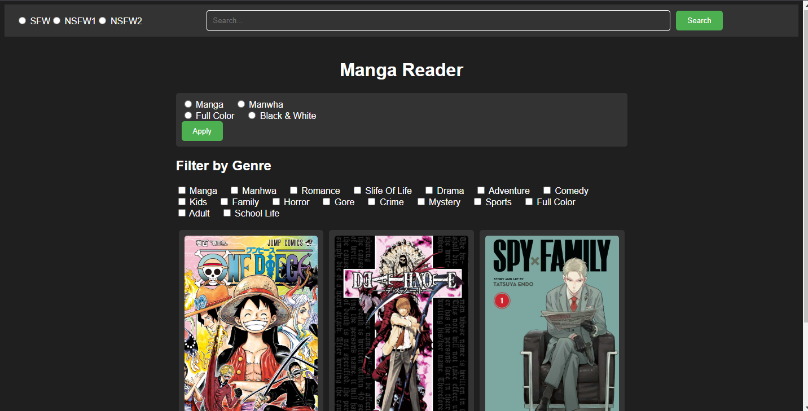

# Manga Reader by Malek Mansour

Manga Reader by Malek Mansour is a web application for reading manga online. It allows users to browse through a collection of manga titles, apply filters, and search for specific manga.



## Features

- Browse and read manga online
- Apply filters by genre, type, color, and SFW status
- Search for specific manga titles
- Responsive design for mobile and desktop devices

## Technologies Used

- HTML5
- CSS3 (with Flexbox)
- JavaScript (ES6)
- External libraries: None

## Getting Started

To get started with Manga Reader, follow these steps:

1. Clone the repository:
   ```bash
   git clone https://github.com/MalekMansour/Manga-Reader

2. Open the index.html file in your web browser.

## Usage
- Browse through the manga collection by scrolling through the covers.
- Use the filter options to narrow down manga by genre, type, color, and SFW status.
- Use the search bar to find specific manga titles.
- Click on a manga cover to read it online.

## Acknowledgements
- MangaPark for providing manga data and covers.
